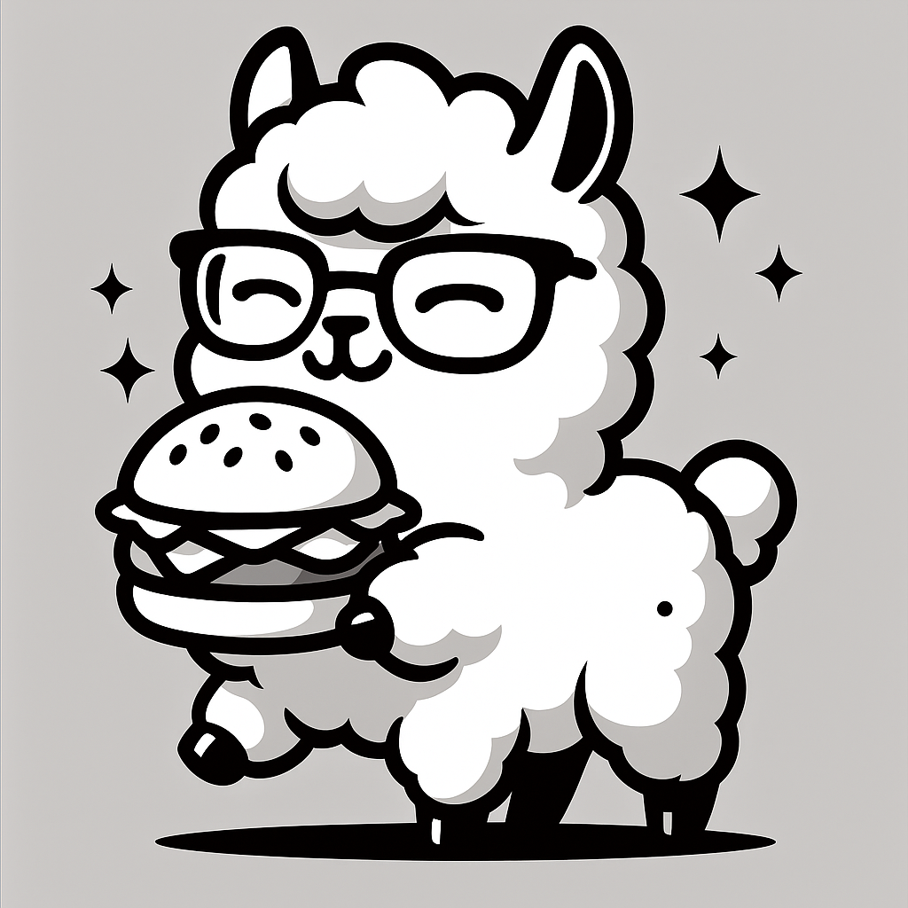

# 🕶️ 虛擬眼鏡試戴系統


智能虛擬眼鏡試戴服務，支持透明眼鏡和墨鏡的真實佩戴效果。

## ✨ 功能特色

- 🎯 **精確人臉檢測**：使用 Google MediaPipe 進行 468 個面部特徵點檢測
- 👓 **智能眼鏡適配**：自動計算最佳縮放比例和位置
- 🌟 **半透明效果**：透明眼鏡支持半透明鏡片效果，墨鏡保持不透明
- 🔄 **自動對齊**：根據眼睛角度自動旋轉眼鏡
- 🌐 **Web 界面**：提供美觀易用的網頁界面
- 🚀 **RESTful API**：完整的 API 接口支持集成開發

## 🎭 支持的眼鏡類型

### 透明眼鏡 (Regular Glasses)
- `glasses_2`: 圓框透明眼鏡 - 復古圓框設計
- `glasses_3`: 方框透明眼鏡 - 現代商務風格  
- `glasses_4`: 貓眼框透明眼鏡 - 優雅女性魅力
- `glasses_5`: 運動框透明眼鏡 - 輕量舒適
- `glasses_7`: 橢圓框透明眼鏡 - 適合各種臉型
- `glasses_8`: 大框透明眼鏡 - 時尚個性設計
- `glasses_9`: 細框透明眼鏡 - 簡約優雅

### 墨鏡 (Sunglasses)
- `glasses_1`: 經典黑框墨鏡 - 時尚戶外使用
- `glasses_6`: 飛行員墨鏡 - 經典永不過時

## 🚀 快速開始

### 1. 環境準備

```bash
# 創建 conda 環境
conda create -n cv python=3.11
conda activate cv

# 安裝依賴
pip install -r requirements.txt
```

### 2. 啟動服務

```bash
conda activate cv
python main.py
```

服務將在 `http://localhost:8000` 啟動

### 3. 訪問界面

打開瀏覽器訪問：
- **Web 界面**: http://localhost:8000
- **API 文檔**: http://localhost:8000/docs
- **健康檢查**: http://localhost:8000/health

## 📱 使用方法

### Web 界面使用

1. 📷 **上傳照片**：選擇包含清晰人臉的照片
2. 👓 **選擇眼鏡**：從 9 種眼鏡款式中選擇
3. ⚡ **開始試戴**：點擊按鈕開始處理
4. 💾 **下載結果**：保存試戴效果圖

### API 使用

#### 獲取眼鏡列表
```bash
curl http://localhost:8000/glasses
```

#### 根據類型獲取眼鏡
```bash
# 獲取透明眼鏡
curl http://localhost:8000/glasses/type/regular

# 獲取墨鏡
curl http://localhost:8000/glasses/type/sunglasses
```

#### 虛擬試戴
```bash
curl -X POST \
  -F "image=@your_photo.jpg" \
  -F "glasses_id=glasses_1" \
  http://localhost:8000/try-on
```

## 🏗️ 系統架構

```
├── main.py                    # FastAPI 主應用
├── glasses_config.py          # 眼鏡配置管理
├── glasses_service.py         # 核心試戴服務
├── improved_glasses_try_on.py # 改進的試戴算法
├── static/
│   └── index.html             # Web 界面
├── glasses/                   # 眼鏡圖片資源
├── uploads/                   # 上傳文件暫存
├── results/                   # 處理結果輸出
└── requirements.txt       # 項目依賴
```

## 🔧 核心算法

### 1. 人臉特徵點檢測
- 使用 MediaPipe Face Mesh 檢測 468 個面部特徵點
- 提取關鍵眼部特徵點（眼角、眼皮、鼻樑等）

### 2. 眼鏡適配計算
- 計算兩眼中心距離和眼睛尺寸
- 根據實際眼部測量數據計算最佳縮放比例
- 自動檢測眼睛角度並旋轉眼鏡

### 3. 圖像合成
- 區分鏡框和鏡片區域
- 透明眼鏡：鏡片半透明效果（70% 透明）
- 墨鏡：鏡片不透明效果（20% 透明）

## 🎯 API 端點

| 方法 | 端點 | 描述 |
|------|------|------|
| GET | `/` | Web 界面首頁 |
| GET | `/glasses` | 獲取所有眼鏡列表 |
| GET | `/glasses/{id}` | 獲取特定眼鏡信息 |
| GET | `/glasses/type/{type}` | 根據類型獲取眼鏡 |
| POST | `/try-on` | 執行虛擬試戴 |
| GET | `/results/{filename}` | 獲取處理結果 |
| GET | `/health` | 健康檢查 |
| DELETE | `/cleanup` | 清理臨時文件 |

## 📦 依賴項目

- **FastAPI**: Web 框架和 API 服務
- **MediaPipe**: Google 的機器學習框架，用於人臉檢測
- **OpenCV**: 計算機視覺庫，用於圖像處理
- **NumPy**: 數值計算庫
- **Pillow**: Python 圖像處理庫
- **Uvicorn**: ASGI 服務器

## 🔄 添加新眼鏡

1. **添加眼鏡圖片**：將 PNG 格式的眼鏡圖片放入 `glasses/` 目錄

2. **更新配置**：在 `glasses_config.py` 中添加新的眼鏡配置：

```python
"glasses_10": GlassesInfo(
    id="glasses_10",
    name="新款眼鏡",
    filename="glasses_10.png",
    type=GlassesType.REGULAR,  # 或 GlassesType.SUNGLASSES
    lens_opacity=0.3,  # 透明度設置
    description="新款眼鏡的描述"
)
```

3. **重啟服務**：重新啟動 API 服務即可

## 🐛 故障排除

### 常見問題

1. **未檢測到人臉**
   - 確保照片中人臉清晰可見
   - 避免側臉或遮擋嚴重的照片

2. **眼鏡尺寸不合適**
   - 系統會自動計算最佳尺寸
   - 如需調整，可修改 `calculate_glasses_scale` 方法

3. **透明效果不理想**
   - 調整 `glasses_config.py` 中的 `lens_opacity` 值
   - 值越小越透明（0-1 範圍）

### 日志查看

服務運行時會輸出詳細的處理信息，包括：
- 眼部測量數據
- 縮放和旋轉參數
- 圖像合成過程